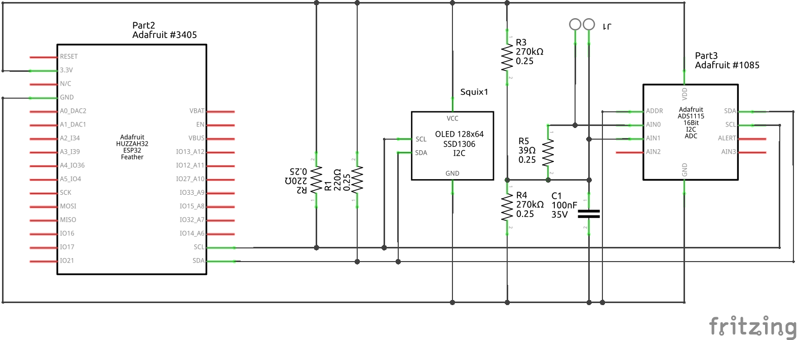

I've never used arduino before - surprisingly productive ecosystem for a weekend. J1 is a 100A:50mA current transformer, YHDO SCT013.

TODO
---
* Better decoupling or buffer of vref - C1 not enough to reduce ripple on A1 pin.
* curve fitting / 0-crossing for Irms
* voltage?
* bluetooth LE announcements / GANT spec.
* Auto ranging code in ADS1115_WE
* battery voltage to state-of-charge exponential fit

See also
---
* Diagrams on page 37 of [Analog 1966fb](https://www.analog.com/media/en/technical-documentation/data-sheets/1966fb.pdf) spec.

